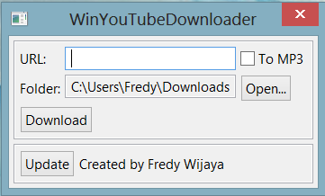

# win-youtube-dl
A very simple GUI wrapper for youtube-dl (http://rg3.github.io/youtube-dl/download.html) Python script.
This application only works on 64-bit Windows (I'm lazy to make it work on 32-bit Windows).
Technically speaking, this application can work on Linux and Mac OSX, but I don't see a point of
having this application run on them since most Linux or Mac OSX users should be familiar with
using a command line.

## Download
[https://github.com/fredyw/win-youtube-dl/releases](https://github.com/fredyw/win-youtube-dl/releases)

## How to build
**win-youtube-dl** requires at least Java 8 to build.
```
build.bat
```

## How to Run
1. Download [Java](https://java.com/en/download/) if you haven't done so.
2. Download `win-youtube-dl.zip` from [https://github.com/fredyw/win-youtube-dl/releases](https://github.com/fredyw/win-youtube-dl/releases)
3. Unzip `win-youtube-dl.zip`
4. Double click on `win-youtube-dl.exe`
5. Click on Update button to make sure you always get the latest update

## Screenshot
    
